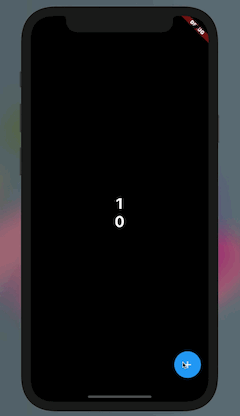
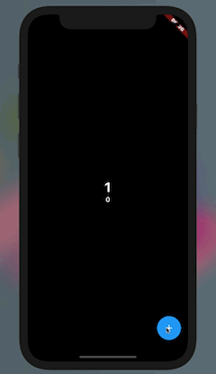
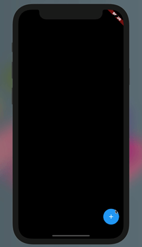

# first_count_app

## Widgetについてのおすすめ記事

- https://zenn.dev/kboy/books/ca6a9c93fd23f3/viewer/0f62d6#scaffold


## やること

### 普通のカウントアプリ

### デザインを少しアレンジ

1. 背景色を変える（黒色）
2. SafeAreaをつける
3. TextStyleを変更する
     - フォントサイズ
     - フォントウェイト
     - フォントカラー（白色）


### Columnを使って二つのカウントを表示する

| 完成                       | エクササイズ完成                    |
| -------------------------- | ----------------------------------- |
|  |  |


1. SafeAreaの下にColumnを入れて、
2. childrenに元々あったウィジェットを配置する
3. mainAxisAlignmentを設定する


4. count2という変数を宣言する
5. 2.と同じことをやる
6. 5.で宣言したウィジェットの`count`を`count2`に変更する
7. `plusNumber`の処理を変更する
     - `Random()`, `rand.nextInt(n)`
     - `plusNumberRandomly`
8. setStateを他の場所にも使ってみる（Exercise）
   - 数字が増えたらフォントを大きくする
   - 数字が増えなければフォントを通常にする


### ListViewを使って複数のカウントを表示する

| 完成                      |
| ------------------------- |
|  |

1. `buildBody`メソッドに書く


```dart
SafeArea buildBody() {
  return SafeArea(
      child: ListView.builder(
          itemCount: countList.length,
          itemBuilder: (context, index) {
            int count = countList[index];
            return ListTile(
                title: Text(
                  "$count",
                  style: TextStyle(color: Colors.white),
                ),
                trailing: Container(
                  decoration: BoxDecoration(
                    shape: BoxShape.circle,
                    color: Colors.blue,
                  ),
                  child: IconButton(
                    icon: Icon(Icons.add, color: Colors.white),
                    onPressed: () {
                      setState(() {
                        countList[index] += 1;
                      });
                    },
                  ),
                ));
          }));
}
```

2. SafeArea以降を`buildBody`に置き換える
3. 以下のコードを削除する

```dart
int count = 0;
int count2 = 0;
double fontSize = 32;
double fontSize2 = 32;
```

4. `changeCountRandomly`を`createNewCount`にする
5. `createNewCount`の処理を変更する


```dart
void createNewCount() {
  setState(() {
    countList.add(0);
  });
}
```

6. 文字色やボタンのアイコン色を白色にする
7. アイコンを装飾する
   1. Containerでラップして背景色をつける
   2. 丸形にしてみる


